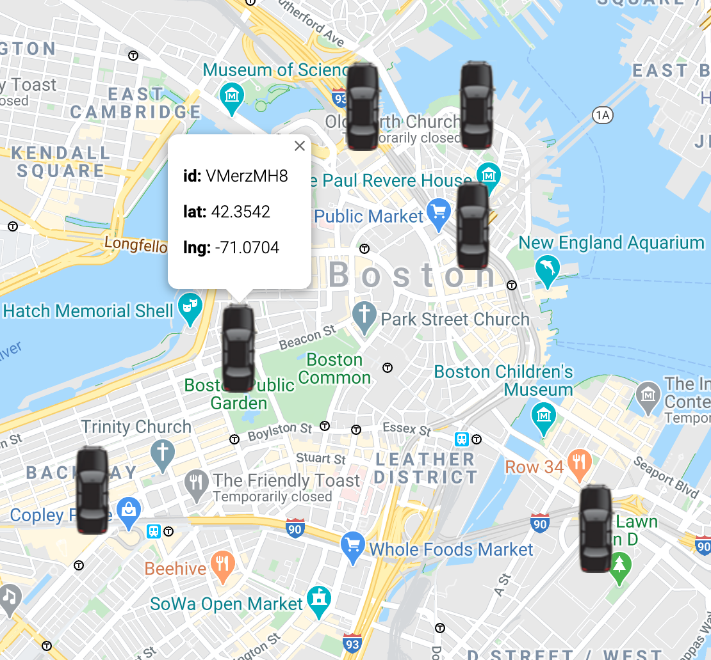
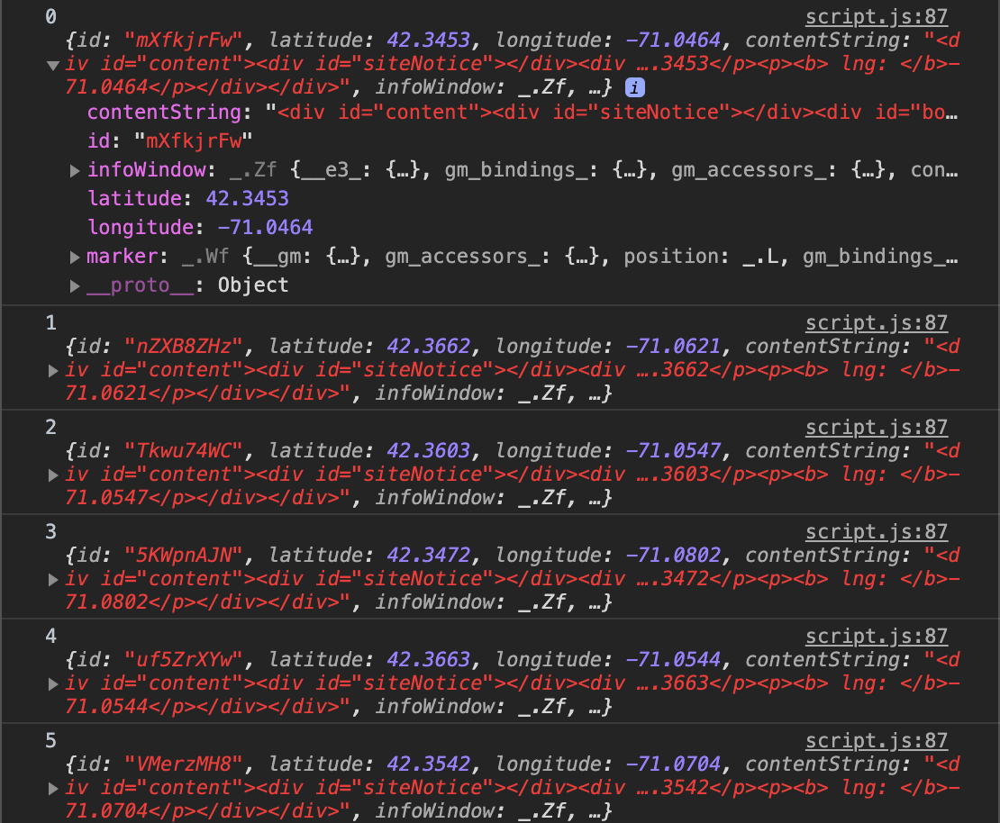

## Reflections
It felt wrong to write a script that treated the JSON data as fixed in length, specifically for a ride-hailing app, where the # of cars available at any given time would be unknown. Perhaps it makes more sense to treat JSON data as fixed in length in other cases, for example, making the same recurring API call and expecting the same length for the JSON data received. 

### For .. in

In my lab, I first started with a `for..in` loop to iterate over the array created (`vehicles`). See snippet below.  Where for every entry in the array `vehicles`, that entry's held data is used to format the map markers and info window. 

```javascript
for (var key in vehicles){
  if (vehicles.hasOwnProperty(key)){
    var id = vehicles[key].id;
  	var lat = vehicles[key].latitude;
  	var lng = vehicles[key].longitude;
  	var pos = {lat, lng};

    var contentString = '<div id="content">'+
      '<div id="siteNotice">'+
      '</div>'+
      '<div id="bodyContent">'+
      '<p>' + '<b> id: </b>' + id + '</p>' +
      '<p>' + '<b> lat: </b>' + lat + '</p>' +
      '<p>' + '<b> lng: </b>' + lng + '</p>' +
      '</div>'+
      '</div>';

    var infowindow = new google.maps.InfoWindow({
        content: contentString
    });

  	var marker = new google.maps.Marker({
  		position: pos,
  		icon: car, 
  		map: map,
  		animation: google.maps.Animation.DROP
  	});

    marker.addListener('click', function(){
        infowindow.open(map,marker);
    });
  }
}
```

This version created successfully unique instances of markers but it did *not* create unique instances of markers. Furthermore, every time any car was clicked, only 1 infowindow for 1 car showed up, no matter which car was clicked (i.e. it seems only 1 instance of infowindow was created). My guess is that there were unique instances of all the markers and infowindows via the `var ... new` initialization, as well as unique event handlers because the page responded whenever any car was clicked. But the event handler was listening to only 1 `infowindow` which is referenced in the `marker.addListener` line. As in, the event handler would listen to 1 marker, but move on to listening to the next marker at each iteration of the for loop. To see this version in action, change line 12 in `index.html` from `<script src="script.js"></script>` to `<script src="script-archived.js"></script>`. Below is a screenshot:



### forEach

My second attempt, I tried using the `forEach` method of the JS array object. I'm guessing because this method exists for the array object in JS, it is best practice anyway to use this instead of the `for .. in` loop when possible.

>`forEach()` method of the array object iterates over the array’s items, in ascending order, without mutating the array

See snippet below.

```javascript
function initVehicle(vehicle){
  var id = vehicle.id;
  var lat = vehicle.latitude;
  var lng = vehicle.longitude;
  var pos = {lat, lng};

  var contentString = '<div id="content">'+
        '<div id="siteNotice">'+
        '</div>'+
        '<div id="bodyContent">'+
        '<p>' + '<b> id: </b>' + id + '</p>' +
        '<p>' + '<b> lat: </b>' + lat + '</p>' +
        '<p>' + '<b> lng: </b>' + lng + '</p>' +
        '</div>'+
        '</div>';
  var infowindow = new google.maps.InfoWindow({
          content: contentString
      });

  var marker = new google.maps.Marker({
    position: pos,
    icon: car, 
    map: map,
    animation: google.maps.Animation.DROP
  });

  marker.addListener('click', function(){
      infowindow.open(map,marker);
  });

  vehicleStack.push(vehicle);
} 

// Generate map
function initMap() {
  map = new google.maps.Map(document.getElementById('map'), {
    center: sboston,
    zoom: 14
  });

  vehicles.forEach(initVehicle);
}
```

I'm not entirely sure why the `forEach` attempt worked whereas the `for ..in` loop didn't, as I simply copied and pasted the code for creating infowindow, marker, and eventhandler to a function that I call in `vehicles.forEach(initVehicle)`. As this is the only difference between the `forEach` and `for ..in` attempts, I'm assuming the solution is related to scoping in some way. In an abstract way, I imagine `forEach` treated each array item more discretely compared to the for loop. Perhaps there was some scope leakage in the `for ..in` loop where my instances leaked into the global scope; and in this version, the leakage was avoided.

### Stack

Lastly, I wondered if I created all these instances of marker, infowindow, and eventhandler, where would they all go once I created them? How would I access them again if necessary. I arbitrarily chose a `stack` struct object to hold my newly formed "vehicles" (i.e., add new properties of marker, infowindow, and eventhandler to each vehicle instance). I used `console.log()` to get sight into my stack, and the output is screenshotted below:



```javascript
  var vehicleStack = [];

  ...


  function initVehicle(vehicle){ 
    ...

    // add properties to capture new data
    vehicle.contentString = contentString;
    vehicle.infoWindow = infowindow;
    vehicle.marker = marker;

    vehicleStack.push(vehicle);
  }

  // Get sight into vehicleStack

  for (let key in vehicleStack) {
   if (vehicleStack.hasOwnProperty(key)) {
      console.log(key, vehicleStack[key]);
   }
  }
```

## References:
[https://dmitripavlutin.com/foreach-iterate-array-javascript/](https://dmitripavlutin.com/foreach-iterate-array-javascript/)

[https://stackoverflow.com/questions/36240520/creating-an-indefinite-amount-of-items](https://stackoverflow.com/questions/36240520/creating-an-indefinite-amount-of-items)
